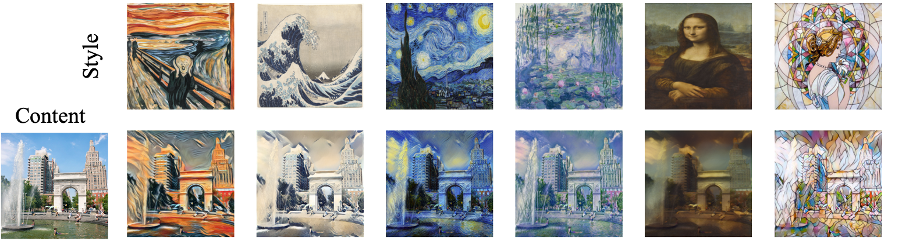

# Neural Style Transfer
This project is in fulfillment of CSCI-SHU 360 Machine Learning in Spring 2021 at NYU Shanghai.
Group member: Xinyue Liu, Yuejiao Qiu

## Problem description
The development of convolutional neural networks (CNNs) has enabled the computer to extract abstract features of images, which also leads to the emergence of deep-learning-driven image modification, <i>neural style transfer</i>. Neural style transfer consists of synthesising a texture from a source image while constraining the texture synthesis in order to preserve the content of a target image. In this project, we implement two different algorithms to realize the artistic style transformation. We first use VGG19 for a fixed pairwise  style and content in an iteration approach, and then adopt image transfer network to train a sytle-specific model for fast style transfer.

## Data
As for style images, we primarily use famous paintings as styles, which are accessible at [Style](/Style). The original source is from [Kaggle](https://www.kaggle.com/momincks/paintings-for-artistic-style-transfer).

The first model, basic style transfer using IOB-NST algorithms, inputs one specific style image and one content image into the iteration loop. Therefore, in the first model, we can use an arbitrary pair of style and content images for each transfer. However, for the second generative model, since we are going to train the model for real-time style transfer, it is of great importance to use a sufficiently large dataset as content images to train the model. Therefore, we choose to use [LabelMe](http://labelme2.csail.mit.edu/Release3.0/browserTools/php/publications.php), which is a large dataset created by the MIT Computer Science and Artificial Intelligence Laboratory containing 187,240 images. For actual training, due to time and efficiency concern, we only use a subset of 20,000 images.

## Experiment
### Basic style transfer
Basic style transfer ultilizes a pre-trained VGG19 as the loss network, which includes 16 convolutional and 5 pooling layers. We normalize the network by scaling the weights so that the mean activation of each filter over images and positions is equal to one. And we replace max pooling by average pooling. We also remove the fully connected layer, since we can directly output an image of the same dimensions. According to Gatys et al., we will use {relu1_1, relu2_1, relu3_1, relu4_1, relu5_1} as style layers and {relu4_2} as the content layer. The results are as below.

